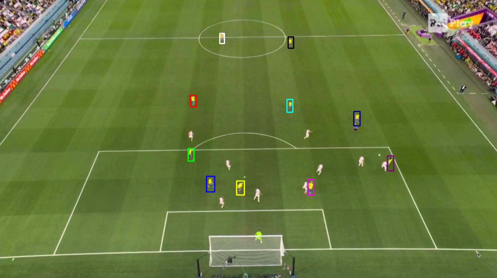
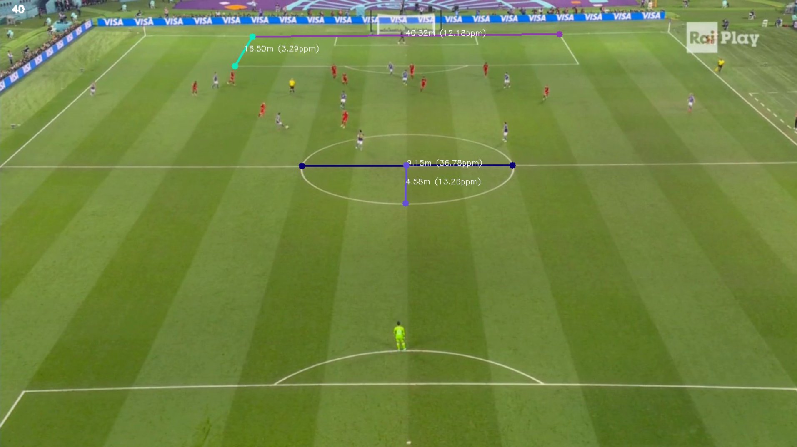

# Football Player Tracking and Performance Analysis with OpenCV

## Overview
This repository contains the implementation of a **Football Player Tracking and Performance Analysis** system using **OpenCV**. The project is based on the methodology described in the paper *Football Player Tracking and Performance Analysis Using the OpenCV Library* by Merzah et al. The main objective is to track football players in match footage, compute performance metrics such as **speed estimation, distance covered, and activity count**, and analyze the results for sports analytics.

## Features
- **CSRT Tracker Implementation**: Tracks multiple players from video footage.
- **Speed and Distance Calculation**: Uses pixel-per-meter conversion to estimate real-world movement.
- **Activity Count Metric**: Analyzes player activity based on histogram comparisons.
- **Video Processing**: Generates an output video with tracking and performance metrics overlayed.

## Repository Structure
```
📂 football-tracking
│── 📄 README.md            # Project documentation
│── 📄 tracking_csrt.py     # Player tracking implementation using CSRT tracker
│── 📄 metrics.py           # Performance metric calculations
│── 📄 aux_func.py          # Auxiliary functions for tracking and metric computation
└── 📄 requirements.txt     # Python dependencies
```

## Installation
To run this project, you need to install Python and the necessary dependencies.

### Prerequisites
- Python 3.x
- OpenCV
- NumPy

### Setup
1. **Clone the repository**
   ```bash
   git clone https://github.com/saulleyva/football-tracking-opencv.git
   cd football-tracking
   ```
   
## Usage
### 1. Tracking Players
To track football players in a video and generate bounding box data:
```bash
python tracking_csrt.py
```

The first frame of the video will appear. The user has to manually select the players they want to track by clicking and dragging the mouse over each player to draw a bounding box.

- Once a bounding box is drawn, press **Space** to save it.
   - This process can be repeated **for multiple players**.
- After selecting all the bounding boxes you need, press **Enter**

<div align="center">

</div>

The script will then process the video and generate a CSV file containing tracking data for each frame, such as **frame number, player ID, bounding box coordinates, and colors** for each tracked player.

### 2. Compute Performance Metrics
To analyze player performance based on the tracking data:
```bash
python metrics.py
```


<div align="center">

</div>

This script calculates **speed, distance covered, and activity count**, and generates an output video with visual overlays.

## Methodology
### 1. **Tracking Players**
- The **CSRT tracker** is used to manually initialize bounding boxes around players.
- The bounding boxes are saved to a CSV file for later analysis.

### 2. **Calculating Metrics**
- **Distance Calculation**: Uses Euclidean distance between consecutive frames.
- **Speed Calculation**: Converts pixel movement to meters using a **pixel-per-meter ratio**.
- **Activity Count**: Detects significant visual changes in a region of interest around the player.

## Example Results
### **Tracked Players**


### **Speed and Distance Metrics**
| Player | Distance (m) | Speed (m/s) | Activity Count |
|--------|-------------|-------------|---------------|
| P1     | 104.3       | 5.8         | 32            |
| P2     | 98.7        | 5.3         | 27            |

## Limitations & Future Work
- **Camera movement affects results**: Needs stabilization techniques.
- **Occlusions impact tracking accuracy**: Exploring **deep learning-based tracking** could improve robustness.
- **More advanced activity recognition**: Could use **pose estimation** instead of histogram-based detection.

## Citation
If you use this repository, please cite:
```
@article{Merzah2024,
  author    = {B. M. Merzah, M. S. Croock, and A. N. Rashid},
  title     = {Football Player Tracking and Performance Analysis Using the OpenCV Library},
  journal   = {Mathematical Modelling of Engineering Problems},
  volume    = {11},
  number    = {1},
  year      = {2024}
}
```

## License
This project is licensed under the MIT License.

## Contact
For any questions or collaboration opportunities, feel free to reach out:
- **Author:** Saúl Leyva Santarén
- **Email:** saul.leyva.santaren@udc.es

---
Enjoy tracking football players! ⚽📊
